# PulsPI


**PulsPI** is a Raspberry Pi Pico–based environmental and system monitoring project focused on real-time telemetry, local display output, and extensible control logic for embedded monitoring tasks. It is designed to run reliably on both **Pico W** (with optional networking) and **standard Pico** hardware.

At its core, PulsPI behaves as a small, stateful monitoring appliance rather than a one-shot display script.

---

## Features

* **Realtime Temperature & Humidity Monitoring**  
  Uses a DHT11 sensor with non-blocking reads and cached values to avoid UI freezes.

* **Local LCD Output (16×2 I²C)**  
  Flicker-free display updates using differential line writes instead of full clears.

* **Runtime Command Interface (USB REPL)**  
  Interactive, non-blocking command input supporting:
  * Live value overrides
  * Multi-command input
  * Semicolon-delimited commands
  * Built-in `help` documentation

* **Override Pipeline (First-Class Data)**  
  Command overrides are treated identically to real sensor readings, allowing realistic testing and future control logic validation.

* **Min / Max Tracking (Since Boot)**  
  Tracks minimum and maximum temperature and humidity values and displays them inline.

* **Uptime Tracking with Day Conversion**  
  Converts long uptimes into `Xd HH:MM` format for readability.

* **Optional Networking (Pico W only)**  
  Networking and ICMP ping functionality are loaded conditionally and fail gracefully on non-Wi-Fi hardware.

* **Debug Visibility**
  * Sensor vs override source tracking
  * Runtime state inspection via CLI

---

## Current Display Pages

**Page 1**
```

Up: 1d 04:17
T 32/41 H 38/62

```

**Page 2**
```

Temp: 36 °C
Humid: 45 % RH

```

---

## Architecture Overview

### Core Data Flow
High-level view of how sensor data and runtime overrides flow into shared state and are consumed by outputs.



### Main Loop Execution
Shows how the main loop polls inputs, updates state, and drives consumers without blocking.


For deeper wiring-level diagrams and alternate views, see **[ARCHITECTURE.md](ARCHITECTURE.md)**.

---

## Command Interface

Available at runtime over the USB serial console.

### Examples
```

temp 42
hum 55
time 3d 04:17

```

Multiple commands per line:
```

hum 50 temp 30 time 2d 01:00

```

Semicolon-delimited:
```

temp 35; hum 60; time 5:00:00

```

Help:
```

help
help time

```

Debug:
```

status
sensor
minmax clear

````

---

## Planned Features

* Temperature-based fan control (PWM / relay output)
* Rolling averages and trend data
* Bar-graph / history display page
* Flash-backed persistence for min/max values
* Optional button input for page control

---

## Hardware Requirements

### Required
* Raspberry Pi **Pico** or **Pico W**
* 16×2 I²C LCD (HD44780 compatible)
* DHT11 sensor
* MicroPython

### Optional
* Wi-Fi network (Pico W only)
* External fan or relay hardware (future work)

---

## Installation

1. Clone the repository:
   ```bash
   git clone https://github.com/yung-megafone/PulsPI.git
   cd PulsPI
    ```

2. Flash **MicroPython** to your Pico using Thonny or your preferred tool.

3. Copy the contents of `src/` to the Pico (`main.py`, `config.py`).

4. (Optional) Configure Wi-Fi credentials and ping target in `config.py`.

5. Power the device and open the serial console to interact with PulsPI.

---

## Project Philosophy

PulsPI is intentionally built as:

* A **single-file, inspectable system**
* Hardware-aware (no unnecessary abstractions)
* Resistant to UI jitter and blocking behavior
* Extensible without refactoring core logic

Safety mechanisms and control logic (fan control, alarms) are implemented as *downstream consumers* of validated state, not as ad-hoc logic attached to sensor reads.

---

## License

PulsPI is **source-available software**.

You may use, modify, and deploy this project freely, including for internal commercial purposes.  
Resale, sublicensing, or monetization of PulsPI or derivative works is **not permitted** without explicit permission from the author.

Full license terms are available in **[LICENSE.md](LICENSE.md)**.

---

## Third-Party Libraries

PulsPI includes the following third-party components, used unmodified:

- `pico_i2c_lcd` — MIT License  
- `lcd_api` — MIT License
